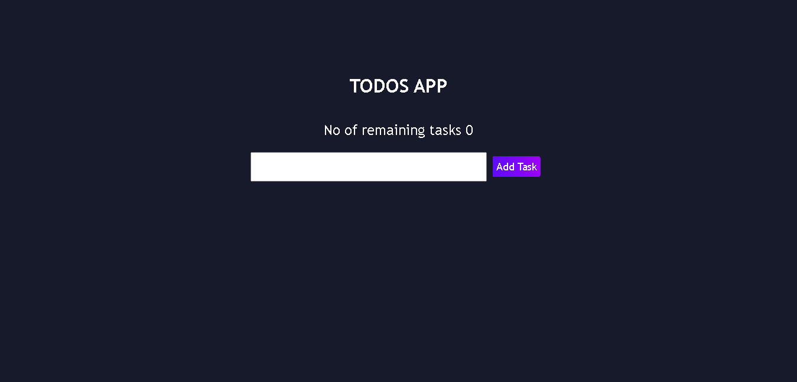
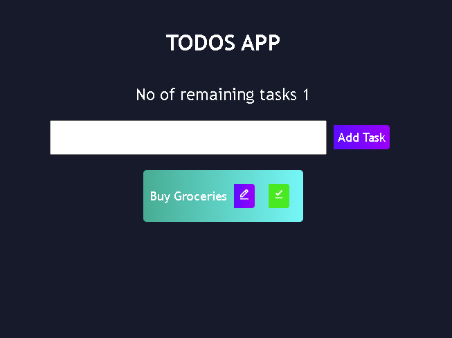

# Getting Started with Create React App

This project was bootstrapped with [Create React App](https://github.com/facebook/create-react-app).

## Available Scripts

In the project directory, you can run:

### `npm start`

Runs the app in the development mode.\
Open [http://localhost:3000](http://localhost:3000) to view it in your browser.

The page will reload when you make changes.\
You may also see any lint errors in the console.

### TODO APP

This is the home page of todo app.

Enter the task in the input field and click on Add Task Button

The user can click on edit to edit any task or click on complete to mark it done and remove from the list.